| Enemy ID            | Original Enemy ID    | Enemy Name   | Enemy Icon                                               |   Num of Appearances |   Num of Wins |   Win Rate |
|:--------------------|:---------------------|:-------------|:---------------------------------------------------------|---------------------:|--------------:|-----------:|
| enemy_15072_dqlbgg  | enemy_2114_dylbgg    | 玉双剑          | 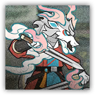       |                  143 |           129 |   0.902098 |
| enemy_15070_dqhlgy  | enemy_2112_dyhlgy    | 枣大刀          | 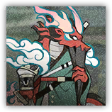       |                  143 |           129 |   0.902098 |
| enemy_15071_dqyrzf  | enemy_2110_dyyrzf    | 炭长矛          |        |                  143 |           129 |   0.902098 |
| enemy_15073_dqkght  | enemy_1513_dekght    | 腐败骑士         | 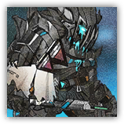       |                  142 |           124 |   0.873239 |
| enemy_15074_dqdght  | enemy_1513_dekght_2  | 凋零骑士         | 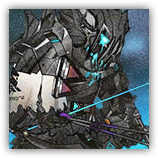   |                  142 |           124 |   0.873239 |
| enemy_15069_dqdeer  | enemy_2054_smdeer    | “萨米的意志”      |        |                   31 |            24 |   0.774194 |
| enemy_15048_dqdivi  | enemy_1436_dsdivi    | 诡核集养者        |        |                 2707 |          2084 |   0.769856 |
| enemy_15068_dqsui   | enemy_1526_sfsui     | 岁相           | 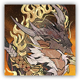         |                   29 |            22 |   0.758621 |
| enemy_15052_dqboar  | enemy_1309_mhboar    | 凶豕兽          |        |                 1305 |           878 |   0.672797 |
| enemy_15018_dqskzc  | enemy_2067_skzcy     | “门”          | 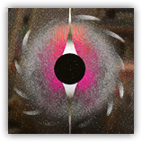         |                 2830 |          1861 |   0.657597 |
| enemy_5035_dqveng_2 | enemy_1025_reveng_2  | 复仇者          | 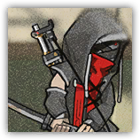   |                 2770 |          1811 |   0.653791 |
| enemy_15040_dqrdmn  | enemy_1114_rgrdmn_2  | 萨卡兹宿主卫巢百夫长   | 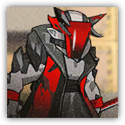   |                 2855 |          1837 |   0.643433 |
| enemy_15093_dqzfkl  | enemy_2099_skzfkl    | 奎隆，摩诃萨埵权化    |        |                   75 |            47 |   0.626667 |
| enemy_15078_dqcjld  | enemy_10052_cjshld   | “果腹”         | 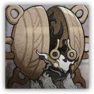     |                 1344 |           839 |   0.624256 |
| enemy_15021_dqdurg  | enemy_1264_durgrd_2  | 烈酒级醒酒助手      | 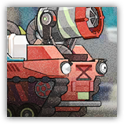   |                 2722 |          1649 |   0.605805 |
| enemy_5036_dqger_2  | enemy_1062_rager_2   | 狂暴宿主组长       |      |                 2792 |          1688 |   0.604585 |
| enemy_15083_dqymot  | enemy_1163_hvymot    | 水手重艇         | 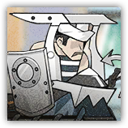       |                 2829 |          1707 |   0.603393 |
| enemy_15085_dqji    | enemy_1207_sfji      | 沉沙           | 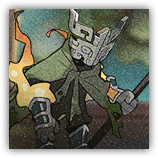           |                 2717 |          1637 |   0.602503 |
| enemy_15009_dqmgcs  | enemy_1350_mgcshp    | 风情街“星术师”     |        |                 2807 |          1685 |   0.600285 |
| enemy_15092_dqudg   | enemy_2026_syudg     | 圣徒卡门         |          |                 1365 |           818 |   0.599267 |
| enemy_15023_dqwlfm  | enemy_1535_wlfmster  | 扎罗，“狼之主”     | 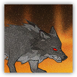   |                  327 |           194 |   0.593272 |
| enemy_15082_dqklr   | enemy_1129_spklr     | “盛怒”         |          |                 1748 |          1033 |   0.590961 |
| enemy_5048_dqingd   | enemy_7002_veingd    | 矿脉守卫         | 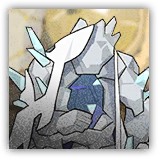       |                 2707 |          1594 |   0.588844 |
| enemy_15033_dqclif  | enemy_7015_xbcrab2   | “钳钳生风”       |      |                  332 |           195 |   0.587349 |
| enemy_15013_dqsnsl  | enemy_1067_snslime   | 冰爆源石虫        | 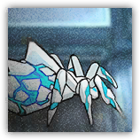     |                 2745 |          1594 |   0.580692 |
| enemy_15088_dqterm  | enemy_1332_cbterm    | “交通亭”量产型     |        |                 2663 |          1545 |   0.580173 |
| enemy_15090_dqacpa  | enemy_1256_lyacpa    | R-11突击动力装甲   | 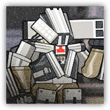       |                 1385 |           797 |   0.575451 |
| enemy_15029_dqfrtu  | enemy_1134_diamd     | 源石畸变体        | 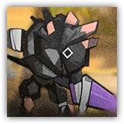         |                 2712 |          1531 |   0.564528 |
| enemy_15030_dqsgpr  | enemy_1153_dsexcu_2  | 富营养的穿刺者      |    |                 2765 |          1544 |   0.558409 |
| enemy_5033_dqmstr_2 | enemy_1044_zomstr_2  | 宿主流浪者        |    |                 1300 |           717 |   0.551538 |
| enemy_15008_dqspsb  | enemy_1123_spsbr     | “阿咬”         |          |                 2748 |          1484 |   0.540029 |
| enemy_15046_dqxts   | enemy_1395_dhxts     | 田鼷           | 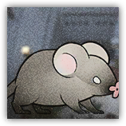         |                 1356 |           726 |   0.535398 |
| enemy_15022_dqhvys  | enemy_1160_hvyslr    | 码头水手         |        |                 3670 |          1942 |   0.529155 |
| enemy_5043_dqgscr   | enemy_1192_krgscr    | 冰原术师         |        |                 2767 |          1428 |   0.516082 |
| enemy_5053_dqllme   | enemy_1050_lslime    | “庞贝”         | 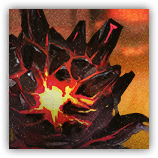       |                 2733 |          1409 |   0.515551 |
| enemy_5040_dqmage   | enemy_1241_ltmage    | 高塔术师         |        |                 2792 |          1439 |   0.515401 |
| enemy_5029_dqslim   | enemy_1305_mhslim    | 灼热源石虫        | 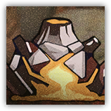       |                 2816 |          1449 |   0.51456  |
| enemy_15077_dqqzts  | enemy_1394_dhzts     | 瘴            | 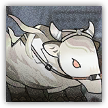         |                 2609 |          1340 |   0.513607 |
| enemy_15014_dqmmka  | enemy_1415_mmkabi    | 温顺的武装驮兽      | 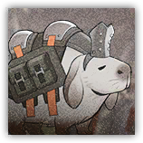       |                 2788 |          1419 |   0.508967 |
| enemy_5039_dqgint   | enemy_1092_mdgint    | 泥岩巨像         | 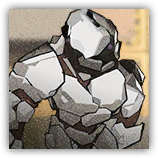       |                 2686 |          1362 |   0.507074 |
| enemy_15086_dqcbld  | enemy_1329_cbshld    | 弧光镜卫         |        |                 3480 |          1751 |   0.503161 |
| enemy_15075_dqzklz  | enemy_2076_skzklz    | 凯尔希          |        |                  149 |            73 |   0.489933 |
| enemy_15076_dqzmst  | enemy_2078_skzmst    | Mon2tr       | 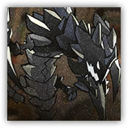       |                  149 |            73 |   0.489933 |
| enemy_15089_dqbgpa  | enemy_1255_lybgpa    | R-31重型动力装甲   | 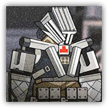       |                 1341 |           645 |   0.480984 |
| enemy_15079_dqkodo  | enemy_1271_nhkodo    | 萨卡兹枯朽吞噬者     | 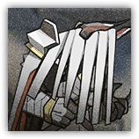       |                 2816 |          1348 |   0.478693 |
| enemy_5031_dqrtar_2 | enemy_1024_mortar_2  | 炮击组长         |    |                 2857 |          1358 |   0.475324 |
| enemy_5037_dqdbox   | enemy_1118_lidbox    | 拳手囚犯         | 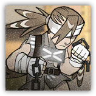       |                 2769 |          1298 |   0.468761 |
| enemy_5028_dqlime_2 | enemy_1004_mslime_2  | 酸液源石虫·α      | 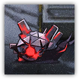   |                 2802 |          1302 |   0.464668 |
| enemy_15002_dqwing  | enemy_1388_wingnt    | “投石机”        |        |                 2646 |          1228 |   0.464097 |
| enemy_5032_dqmon    | enemy_1010_demon     | 萨卡兹大剑手       | 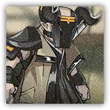         |                  365 |           166 |   0.454795 |
| enemy_15010_dqcadk  | enemy_1184_cadkgt    | 散华骑士团学徒      |        |                 2740 |          1246 |   0.454745 |
| enemy_15026_dqmtrf  | enemy_1035_haxe_2    | 高级武装人员       |        |                 1337 |           604 |   0.451758 |
| enemy_5038_dqiprr_2 | enemy_1117_liiprr_2  | 神射手囚犯        | 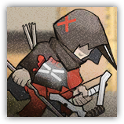   |                 2826 |          1233 |   0.436306 |
| enemy_15094_dqgent  | enemy_1047_sagent    | 狙击步兵         | 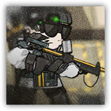       |                 2793 |          1206 |   0.431794 |
| enemy_15080_dqgtop  | enemy_10116_ymgtop   | 水遁忍者         |      |                 2802 |          1194 |   0.426124 |
| enemy_5055_dqkill   | enemy_1516_jakill    | 杰斯顿·威廉姆斯     |        |                 2760 |          1155 |   0.418478 |
| enemy_15095_dqams   | enemy_2093_skzams    | 终曲合声         | 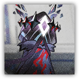       |                 2830 |          1154 |   0.407774 |
| enemy_15028_dqmtrb  | enemy_1097_cclmbjk_2 | 提亚卡乌破坏王      | 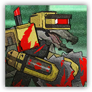 |                 1370 |           555 |   0.405109 |
| enemy_15047_dqwlpl  | enemy_10003_trwlpl_2 | 暴走食人花        |  |                 2778 |          1122 |   0.403888 |
| enemy_15011_dqnhst  | enemy_1270_nhstlk    | 逐腐兽          | 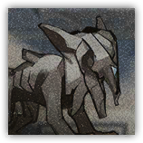       |                 1321 |           519 |   0.392884 |
| enemy_5042_dqkght_2 | enemy_1103_wdkght_2  | 沸血骑士团精锐      | 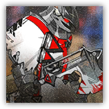   |                 2696 |          1033 |   0.38316  |
| enemy_15084_dqhfly  | enemy_1269_nhfly     | 枯朽之种         | 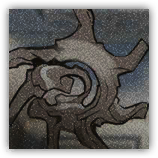         |                 2733 |           962 |   0.351994 |
| enemy_15004_dqdhdt  | enemy_1396_dhdts     | 田鼷力士         | 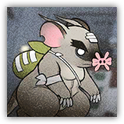         |                 1379 |           454 |   0.329224 |
| enemy_15015_dqmerr  | enemy_1143_merrpg    | 反装甲步兵        |        |                 2873 |           913 |   0.317786 |
| enemy_15091_dqbus   | enemy_1263_durbus    | 全封闭沙滩车       |        |                 2732 |           779 |   0.285139 |
| enemy_15081_dqmage  | enemy_1128_spmage    | “妒”          | 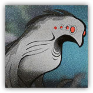       |                 2792 |           731 |   0.261819 |
| enemy_5052_dqsbr    | enemy_2043_smsbr     | 染污躯壳         |          |                 2695 |           659 |   0.244527 |